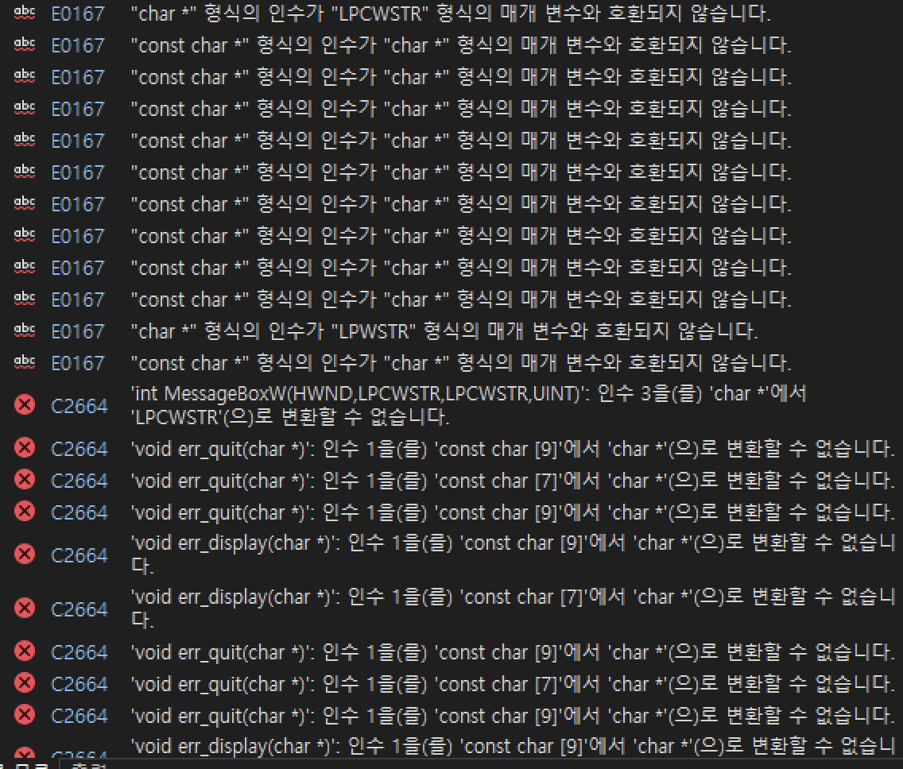

# VS 2020 & x86 환경으로 바꾸기
## Chapter01, Chapter02 예제 실행
- const char * 변환 관련 오류를 확인해서 수정함
- LPCWSTR char * 변환 관련 오류 확인

## 문자열 및 윈도우 자료형 학습
### 리터럴 문자열
- const char * char * 변환이 더 엄격해진 문제
- 암묵적 형변환 대신 명시적 형변환을 하는 방법도 가능할 것
- 함수 내에서 문자열을 변경하지 않기 때문에 인자를 const로 받는 방법으로 해결 `void err_quit(const char* message);`

### LPCWSTR
- 윈도우에서 사용하는 자료형의 일종 [출처](https://www.tenouk.com/ModuleC.html)
- 유니코드 문자, wchar_t와 유사
- Pointer to a null-terminated string of 16-bit Unicode characters.  
- This type is declared in winnt.h as follows: 
`typedef WCHAR *LPWSTR`;
### LPSTR 와 비교
- 일반적으로 사용하는 ANSI 문자열 
- Pointer to a null-terminated string of 8-bit Windows (ANSI) characters. 
- This type is declared in winnt.h as follows: 
`typedef CHAR *LPSTR`;
