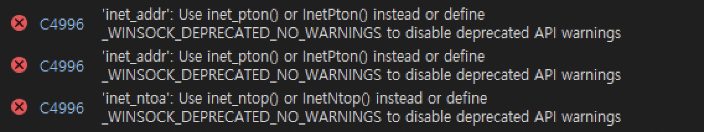

# VS 2020 & x86 환경으로 바꾸기
## Chapter03 예제 실행
- 이미 확인된 오류는 생략
- 오류에서 추천하는 함수 학습 


## inet_addr() → inet_pton()

> 'inet_addr': Use inet_pton() or InetPton() instead or define _WINSOCK_DEPRECATED_NO_WARNINGS to disable deprecated API warnings	Server
> 

**`inet_addr()`**

- 점으로 구분된 IPv4 문자열을 IN_ADDR 구조체로 변환하는 함수

```cpp
unsigned long WSAAPI inet_addr(
  const char *cp
);
```

**`inet_pton()`**

- IPv4, IPv6 표준형식 문자열을 IN_ADDR 혹은 IN6_ADDR 구조체로 변환
- ANSI 표준
- 반환값
    - 성공시 1 반환, 버퍼에 구조체를 담은 포인터 저장
    - 실패 0 반환, invalid string
    - 실패 -1 반환, 자세한 오류 저장 WSAGetLastError로 확인해야

```cpp
INT WSAAPI inet_pton(
  [in]  INT   Family,
  [in]  PCSTR pszAddrString,
  [out] PVOID pAddrBuf
);
```

## inet_ntoa → inet_ntop()

> 'inet_ntoa': Use inet_ntop() or InetNtop() instead or define _WINSOCK_DEPRECATED_NO_WARNINGS to disable deprecated API warnings	Server
> 

**`inet_ntoa()`**

- IPv4 주소를 점으로 구분된 형식의 ASCII 문자열로 변환

```cpp
char *WSAAPI inet_ntoa(
  in_addr in
);
```

**`inet_ntop()`**

- IPv4, IPv6 구조체를 문자열로 변환
- ANSI 표준
- 반환값
    - 성공시 문자열 주소 반환
    - 실패시 NULL 반환 후 오류 저장

```cpp
PCSTR WSAAPI inet_ntop(
  [in]  INT        Family,
  [in]  const VOID *pAddr,
  [out] PSTR       pStringBuf,
  [in]  size_t     StringBufSize
);
```